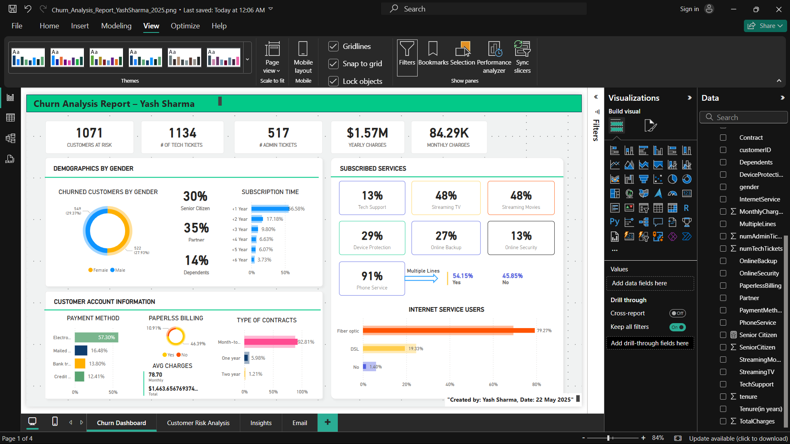

# Customer Churn Analysis - Power BI Project

This project is a customer churn analysis dashboard built using **Power BI**. The goal is to help businesses identify customers who are at risk of leaving (churning) and take proactive steps to retain them.

## 📊 Dashboard Highlights

- **Customer Risk Analysis**
- **Key Insights on Churn**
- **Overall Churn Metrics**

## 🛠 Tools Used

- Power BI
- DAX
- Data Cleaning & Modeling

## 📁 Project Files

- `.pbix` file with full report
- Screenshots of dashboard
- Summary report image

## 👨‍💻 Developed By

**Yash Sharma**  
B.Tech Computer Science, Poornima University  
[LinkedIn](https://www.linkedin.com/in/yash-sharma-8a04b82b8) | [GitHub](https://github.com/hsaysh)
